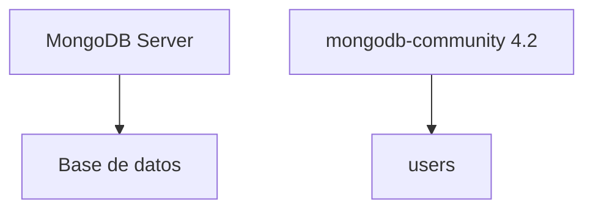
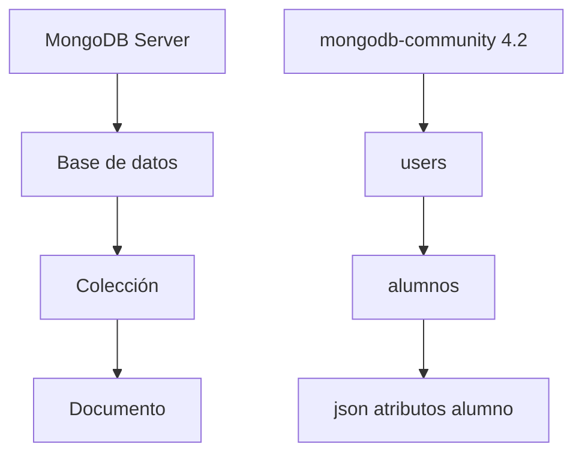

# Notas de MongoDB

## Bases de datos tradicionales / SQL / relacionales

Se organizan en entidades llamadas tablas.

Cada tabla está formada por filas (rows) o registros.

Pueden existir relaciones entre tablas (relacionales). Estas relaciones se *articulan* con respecto a uno o más atributos de las tablas relacionadas.

Usan SQL como lenguaje de consulta.

Permiten el uso de transacciones lo que garantiza que se cumplan los principios ACID:

* Atomicidad: una transacción se ejecuta o no se ejecuta.
* Consistencia: una transacción no puede dejar la base de datos en un estado inconsistente.
* Aislamiento: una transacción no puede ver los cambios que otras transacciones están realizando sobre la base de datos.
* Durabilidad: una vez que una transacción se ha completado los cambios realizados por la misma se mantienen aunque se produzca un fallo.

Para dividir la información entre tablas se emplean procesos de normalización (cuyo objetivo es evitar redundancia de datos y facilitar la realización de consultas).

Siguen un **esquema** (todos los registros / rows de cada tabla tienen el mismo número de campos con el mismo tipo de datos). Cada tabla (y en consecuencia la BD) sigue una estructura predefinida.

## Bases de datos NoSQL

Surgen como respuesta a problemas que las BD tradicionales no podían resolver:

* La información que se quiere guardar no está estructurada.
* Muy poco flexibles (debido a que se ha de cumplir el **esquema**).

Son las ideales para almacenar datos que no tienen una estructura fija.

**No garantizan** los principios **ACID**.
**MongoDB sí soporta transacciones.**

NoSQL = No sólo SQL.

Existen varios tipos:

* Documentales (MongoDB).
* Clave-valor: funcionan como índices (Amazon DynamoDB).
* Columnares: (Cassandra)
* Orientadas a grafos: ¿estadística y Big Data? (Amazon Neptune).

## Características de MongoDB

* Orientada a documentos.
* Sin esquema *schemaless*.
* Usa JSON.

### Formato JSON

Javascript Simple Object Notation

```json
{
    "numero": 10,
    valores: [1, 2, 3],
    masValores: {
        uno: [{uno: 1}, {dos: true}, {tres: 3}],
        dos: false
    }
}
```

### Instalación de MongoDB

En la página de [MongoDB](https://www.mongodb.com/) podemos encontrar las instrucciones de instalación para los distintos sistemas operativos. En concreto para Linux (Ubuntu) podemos encontrarlas [aquí](https://docs.mongodb.com/manual/tutorial/install-mongodb-on-ubuntu/).

Pondré unas notas sobre el proceso de instalación en Linux (Ubuntu).

### Incorporar datos de prueba

Para incorporar datos de prueba podemos usar el comando `mongoimport`:

```text
mongoimport -d <nombre de la base de datos> -c <nombre de la colección> -f <ruta del fichero con los datos>
```

### Uso desde la consola

En Linux la consola se invoca escribiendo `mongosh` (en Windows y macOS con `mongo`).

Comandos básicos:

* Salir de la consola: `.exit` (también se puede usar `quit`)
* *Limpiar* la consola: `Ctrl + L`.
* Mostrar información de ayuda sobre los comandos: `db.help()`.
* Mostrar las bases de datos del servidor: `show dbs`.
* Seleccionar una base de datos: `use <nombre de la DB>`.
* Colecciones o *tablas* que puedes tener una una DB: `show collections` o `show tables`.
* Consultar el nombre de la base de datos activa: `db.getName()`.
* Consultar los metadatos de la base de datos activa: `db.stats()`.
* Obtener información sobre el sistema dónde se está ejecutando Mongodb: `db.hostInfo()`.
* *Mostrar el contenido de una colección*: `db.<colección>.find().pretty()`.

### Creación y gestión de bases de datos



Para crear una base de datos simplemente hay que indicar que se quiere *usar* una base de datos con ese nombre.

Si queremos crear una base de datos con el nombre `clientes` escribiremos el comando: `use clientes` (en realidad no la mostrará hasta que se inserte algún elemento).

Para insertar un elemento (**documento**) podemos usar el comando:

```text
db.clientes.insertOne({'id': '1', 'nombre': 'Manuel', 'Apellidos': 'Piñeiro Mourazos'})
```

También crearíamos la base de datos `cliente` si utilizamos únicamente la instrucción previa.

**Para eliminar una base de datos** primero la tenemos que hacer activa con `use <nombre DB>` y después invocaremos el comando `db.dropDatabase()`.

## Colecciones y documentos



### Colección

El equivalente en MongoDB a las tablas de las bases de datos tradicional.

### Documento

El equivalente a las *filas* o *registros* de una base de datos tradicional.

### Propiedades

Lo que un *registro* de las bases de datos tradicionales se denominaría *columnas* o campos.

## Tipos de datos

Los tipos de datos descritos en MongoDB se dividen en dos tipos básicos: **simples** y **complejos**.

### Tipos de datos simples

* números
* cadenas de texto
* fecha y hora: se muestra con formato ISO 8601.
* booleanos

#### Ampliación sobre fechas

Para insertar la fecha y hora de hoy en un documento podremos usar el comando `Date()`.

```json
{
    actualizado: Date()
}
```

Para indicar una fecha concreta hemos de usar el comando `new Date(<fecha>)`.

```json
{
    fecha_nacimiento: new Date('1900-01-01')
}
```

La función / constructor de `Date` acepta los siguientes formatos:

* `<YYYY-mm-dd>` especifica la fecha en el formato ISODate y devuelve el ISODate con la hora establecida a medianoche en UTC.
* `new Date("<YYYY-mm-ddTHH:MM:ss>")` especifica la fecha en la hora local del cliente y devuelve el ISODate con la hora establecida en UTC.
* `new Date("<YYYY-mm-ddTHH:MM:ssZ>")` especifica la fecha en UTC y devuelve el ISODate con la hora establecida en UTC.
* `new Date(<integer>)` especifica la fecha como el **tiempo Unix** o **tiempo POSIX**, el número de milisegundos transcurridos desde la medianoche UTC del 1 de enero de 1970.

Establecerá `fecha_nacimiento` al objeto Date de valor equivalente a `1900-01-01T00:00:00:000z`.

También aceptan formatos más *informales*. Por ejemplo: `new Date("15, may, 1977")` o `new Date("01/01/1900 00:00:00")`.

### Tipos de datos complejos

* *arrays*
* objeto
* *binary data*
* *objectId*
* Expresiones regulares

## Operaciones con datos (CRUD)

Dejaremos las consultas para el final.

### *Create* / Insertar

`insertOne` o `insertMany` y usar los filtros de MongoDB.

`db.<nombre de la colección>.insertOne(<json del documento>)`

`db.<nombre de la colección>.insertMany(<json con un array con los documentos>)`

### *Update* / Actualizar

`updateOne` o `updateMany`

`db.<nombre de la colección>.updateOne(<json selector>, <json de actualización>)`

#### Atomicidad

En MongoDB una operación de escritura es atómica a nivel de un único documento. Aún cuando la operación modifique múltiples documentos embebidos en dicho documento.

Cuando una única operación de escritura modifique múltiples documentos la modificación de **cada documento** es atómica pero la operación **en su conjunto** no lo es.

#### Operador `$set`

El operador `$set` reemplaza el valor de un campo por el valor especificado.

##### Sintaxis de `$set`

```json
{ $set: { <campo1>: <valor1>, ... } }
```

Si queremos especificar un campo dentro de un documento embebido hemos de usar la notación con punto.

#### Operador `$inc`

El operador `$inc` *incrementa* el valor de un campo un determinado valor.
Este operador admite valores tanto positivos como negativos.

Este operador es **atómico** a nivel de un **único documento**.

##### Sintaxis de `$inc`

```json
{ $inc: { <campo1>: <cantidad1>, <campo2>: <cantidad2>, ... } }
```

#### Operador `$push`

El operador `$push` añade un valor a un array.

##### Sintaxis de `$push`

```json
{ $push: { <campo1>: <valor1>, ... } }
```

Para indicar un campo en un **documento embebido** se puede usar la **notación de punto**.

##### Modificadores

* `$each`: Añadirá múltiples valores al array.
* `$slice`: Limita el número de elementos a añadir. Debe usarse con el modificador `$each`.
* `$sort`: Ordena los elementos del array. Se usará junto al modificador `$each`. Opciones:
  * Si insertamos elementos simples el valor `1` indicará orden ascendente y `-1` descendente.
  * Si insertamos documentos habrá que indicar el campo y luego especificar `1` o `-1` para indicar orden ascendente o descendente.
* `$position`: Especifica la posición del array en la que insertar los nuevos elementos. Requiere el uso de `$each`. Si no se usa `$position` `$push` insertará el elemento al final del array.

**Ejemplo de sort**:

  ```json
  { $push: {
    <campo1>: { $each: [ { <c1>: 1, <c2>: 'a'}, { <c1>: 2, <c2>: 'b'}], 
    sort: { <c1>: -1}}
  }}
  ```

###### Sintaxis de los modificadores

```json
{ $push: { <campo1>: { <modificador1>: <valor1>, ...}, ... } }
```

La forma de procesarse los modificadores será la siguiente:

1. Actualizar el array para añadir los elementos en la posición correcta.
2. Aplicar la ordenación si se especificó.
3. *Recortar* el array si se especificó.
4. Guardar el array.

##### Ejemplos de uso

Creamos la colección `estudiantes`:

```json
db.estudiantes.insertOne( { _id: 1, notas: [ 44, 78, 38, 80] } )
```

###### Añadir un valor al array

El siguiente código añadirá el valor 89 al array `notas`:

```json
db.estudiantes.updateOne( { _id: 1 }, { $push: { notas: 89 } } )
```

###### Añadir un valor a un array en múltiples documentos

Añadiremos el valor 89 al array `notas` de todos los estudiantes.

```json
db.estudiantes.updateMany( {}, { $push: { notas: 89 } } )
```

###### Añadir múltiples valores a un array

```json
db.estudiantes.updateOne( { _id: 1 }, { $push: {notas: {$each: [ 90, 92, 95 ] } } } )
```

###### Utilizar `$push` con múltiples modificadores

Crearemos un nuevo estudiante para el ejemplo:

```json
db.estudiantes.insertOne(
    {
    "_id" : 5,
        "quizzes" : [
            { "wk": 1, "score" : 10 },
            { "wk": 2, "score" : 8 },
            { "wk": 3, "score" : 5 },
            { "wk": 4, "score" : 6 }
        ]
    }
)
```

Haremos lo siguiente:

* Usaremos el operador `$each` para añadir cada `quiz` del array al array `quizzes` del documento.
* Usaremos `$sort` para ordenar dicho array `quizzes` de manera **descendiente** (argumento -1).
* Usamos `$slice` para quedarnos únicamente con los tres primeros elementos de `quizzes`.

```json
db.estudiantes.updateOne(
    { _id: 5},
    {
        $push: {
            quizzes: {
                $each: [ { wk: 5, score: 8 }, { wk: 6, score: 7 }, { wk: 7, score: 6 } ],
                $sort: { score: -1 },
                $slice: 3
            }
        }
    }
)
```

Ejemplo: Si tenemos un documento de la colección "usuarios" con el siguiente formato:

```json
{
    id: 1,
    nombre: "Manuel",
    apellidos: "Piñeiro",
    fecha_nacimiento: "1977-05-07"
}
```

Para actualizar `apellidos` y `fecha_nacimiento` a "Piñeiro Mourazos" y "1977-05-15" respectivamente, usaríamos el siguiente comando:

```text
db.usuarios.updateOne({id: 1 }, {apellidos: "Piñeiro Mourazos", fecha_nacimiento: "1977-05-07})
```

**Nota**: se puede añadir atributos.

### *Destroy* / Eliminar

`deleteOne` o `deleteMany` y usar los filtros / selectores de MongoDB. Estos selectores los veremos en el apartado de *read* / consultas pues son los mismos.

Estos selectores lo veremos en detalle en el apartado *Read* / consultas pues son los mismos.

Estos comandos tienen como **valor de retorno** un documento (JSON) con dos campos:

* ***acknowledged***: un valor booleano que será cierto si la operación se ejecutó con *write concern* o falso si no lo hizo.
* ***deleteCount***: Indica el número total de documentos borrados.

#### ¿De qué va eso de *write concern*?

*Write concern* es una forma de ejercer control sobre los *nodos* de un *cluster* mongo a los que ha de llegar la operación. Permite indicar ciertos valores para solicitar que la modificación llegue a la mayoría de nodos o a un número concreto

### *Read* / Consultar

Este función sirve para realizar consultas sobre las colecciones de la base de datos. Para *filtrar* o *seleccionar* los datos que queremos obtener habrá que pasar como argumento cierta información. En MongoDB esta información se pasa en forma de documento JSON.

#### Consultas con tipos de datos simples

Para consultar los documentos de una colección que cumplan una determinada condición se usa el método `find()`.

```text
db.<nombre de la colección>.find(<filtro>)
```

El filtro (o selector) será un documento JSON que indica la condición o condiciones que deben cumplir los documentos que se devuelvan.

`find()` / `find({})` sin filtro devuelve todos los documentos de la colección.

Un selector simple sería aquél que indica que se devuelvan los documentos que tengan un determinado valor en un campo.

```text
db.<nombre de la colección>.find({<campo>: <valor>})
```

El valor de retorno de la función `find()` es un **cursor**. Cuando decimos que una *consulta* devuelve documentos lo que devuelve en realidad es un **cursor a los documentos**. Un cursor es un objeto que permite recorrer los resultados de una consulta.

Para acceder *de verdad* a los documentos hemos de iterar sobre el cursor.

##### ¿Por qué vemos los resultados de la consulta?

Cuando se ejecuta una consulta en la consola de MongoDB se muestra el resultado porque la consola de MongoDB itera sobre el cursor. Si queremos ver el cursor en lugar de los resultados hemos de asignar el resultado de la consulta a una variable.

```javascript
var cursor = db.<nombre de la colección>.find({<campo>: <valor>});
cursor;
```

##### Contar resultados

Para contar los resultados de una consulta se usa el método `count()`.

```text
db.<nombre de la colección>.find(<filtro>).count()
```

Si deseamos conocer el número de elementos de una colección podemos usar `count()` directamente sobre la colección.

```text
db.<nombre de la colección>.count()
```

##### Limitar el número de resultados

De para limitar el número de valores que obtendremos como resultado de una consulta tenemos la función `limit()` que se usa igual que count, añadiéndola después de la consulta. Recibirá como argumento un número entero en el que le indicamos cuantas respuestas nos interesan.

```text
db.<nombre de la colección>.find(<filtro>).limit(<número de resultados>)
```

`limit()` se usa frecuentemente en combinación con `skip()` y `sort()`:

* `skip(<número>)`: Sirve para *saltarse* cierto número de documentos en un resultado (cursor).
* `sort(<documento>)`: Sirve para ordenar los resultados en función a un o más campos.

Ejemplo de sort:

En el documento que se le pasa al sort se indican los campos sobre los que se quiere realizar la ordenación (numérica o lexicográfica). El valor del campo será `1` o `-1`, para indicar si queremos que la ordenación sea creciente o decreciente.

```javascript
db.alumnos.find({aprobado: true}).sort({nota: -1, nombre: 1, apellidos: 1}).limit(3)
```

Con este comando obtendremos los tres alumnos con mejor nota (en caso de empate se ordenarán alfabéticamente por nombre y apellidos).

#### Consultas sobre arrays

##### Seleccionar por igualdad en array

```json
db.alumnos.find( { modulos: ['BDA', 'SBD'] } )
```

En esta consulta hay que tener en cuenta que **importa el orden** de los elementos del array. **Estamos comparando mediante una igualdad**.

##### Seleccionar por contenido del array

Si lo que queremos es buscar los elementos que contienen un elemento (y posiblemente otros) lo haremos de la siguiente manera:

```json
db.alumnos.find({
    modulos: 'SBD'
})
```

Nótese que no se compara con ningún array, si no con un elemento del array.

Si queremos comprobar si contiene viarios elementos a la vez (y posiblemente otros) usaremos el operador `$all`.
El operador `$all` permite consultar los documentos que contengan todos los valores de un array que especificamos.

De esta forma con el siguiente filtro se devolverán los documentos que contengan los valores `matemáticas` y `física` en su array `especialidades`.

```javascript
db.profesores.find({especialidades: $all: ['matemáticas', 'física']})
```

O los alumnos que cursan los módulos `BDA` y `SBD` (y posiblemente otros ya que no es excluyente):

```json
db.alumnos.find({
    modulos: { 
        $all: ['BDA', 'SBD'] 
    } 
})
```

Cuando utilizamos el operador `$all` no importa el orden.

##### Filtros compuestos

Con estos filtros lo que hacemos es poner condiciones a **algún** elemento del array. Así el siguiente código:

```javascript
const cursor = db.collection('inventory').find({
  dim_cm: { $gt: 15, $lt: 20 }
});
```

Seleccionará los documentos cuyo array `dim_cm` contenga **algún elemento** cuyo valor sea estrictamente mayor que 15 y menor que 20.

##### Filtro para TODOS los elementos de un array

Supongamos que tenemos la siguiente base de datos:

```json
[
    {
        'id': 1,
        'notas': [5, 6, 8]
    },
    {
        'id': 2,
        'notas': [4, 5, 7]
    }
]
```

Si queremos seleccionar todos los documentos cuyas notas (**todas**) sean mayores o iguales a 5 hemos de escribir el siguiente código:

```json
db.alumnos.find({
    notas: {$not: {$lt: 5}}
})
```

Puesto que no hay un operador que exija que todos los elementos cumplan una condición, lo que habrá que hacer es exigir que no haya algún elemento que cumpla la condición opuesta.

Por ejemplo, si no queremos que ningún elemento del array de notas contenga la notas 5 y 6:

```json
db.alumnos.find({
    "notas": {
        $not: {
            $all: [5, 6]
        }
    }
})
```

#### Consultas sobre documentos embebidos

Para realizar consultas sobre documentos embebidos se usa la notación de punto.

Si tenemos un documento con la siguiente estructura:

```json
{
    'id': 1,
    'nombre': 'Manuel',
    'apellidos': 'Piñeiro',
    'dirección': {
        'calle': 'Calle de la Rosa',
        'número': 1,
        'piso': 2,
        'puerta': 'A'
    }
}
```

para hacer una consulta sobre el campo `calle` del documento embebido `dirección` escribiríamos:

```json
db.alumnos.find({
    'dirección.calle': 'Calle de la Rosa'
})
```

### Filtros / selectores de MongoDB

Para filtrar en una de las operaciones previas se utilizará un *documento* JSON.

#### Filtro con una condición

Para hacer un filtro con una única condición simplemente se incluye un JSON con el **atributos** y el **valor** del mismo que queremos seleccionar. Si queremos seleccionar los documentos de la colección **usuarios** que están activos podríamos de filtro:

```json
{
    'activo': true
}
```

#### Filtro con múltiples condiciones

Igual que el anterior pero incluyendo en el JSON todos los pares **atributo valor** que nos interese.

```json
{
    'rol': 'admin',
    'activo': true
}
```

#### Filtro con múltiples condiciones posibles (`$or`)

Incluiremos un *atributo* `$or` cuyo valor será un **array** con las condiciones que serían válidas.

``` json
{
    $or: [ { 'rol': 'admin' }, { 'activo': true } ]
}
```

#### Filtro por exclusión (`$not`)

Normalmente lo usaremos junto con el atributo `$eq` para significar *not equal*, es decir, distinto.

```json
{
    'nombre': { $not: { $eq: "Manuel" } }
}
```

#### Operadores lógicos de consulta

* `$not`: Es la única que se aplica a una única expresión. En el resto de operadores lógicos se aplica a un array de expresiones.
* `$and`: Une las cláusulas de búsqueda con un **and** lógico y devolverá los resultados que cumplan todas las cláusulas.
* `$or`: Une las cláusulas de búsqueda con un **or** lógico y devolverá los resultados que cumplan alguna de las cláusulas.
* `$nor`: Une las cláusulas de búsqueda con un **nor** lógico y devolverá los resultados que no cumplan ninguna de las cláusulas.

Ejemplo de `$and`:

```json
{ $and: [ { <expression1> }, { <expression2> } , ... , { <expressionN> } ] }
```

#### Operadores de comparación

Con estos operadores se pueden realizar consultas de comparación sobre los campos de los documentos. Toman como argumento un valor y devuelven los documentos que cumplan la condición.

* `$eq`: Igual a.
* `$ne`: Distinto de.
* `$gt`: Mayor que.
* `$gte`: Mayor o igual que.
* `$lt`: Menor que.
* `$lte`: Menor o igual que.
* `$in`: Igual a cualquiera de los valores de un array.
* `$nin`: Distinto a todos los valores de un array.

De este modo podríamos hacer una consulta para obtener los usuarios con una edad entre 18 y 65 años:

```json
{
    'edad': { $gte: 18, $lte: 65 }
}
```

## Diseño del modelo de datos

### Concepto de *schemaless*

En las bases de datos SQL las tablas se diseñan especificando una serie de restricciones. Estas restricciones indican qué campos que tendrá cada tabla y los *tipos* de valores que podrá contener cada campo. Esta es una forma de indicar que los datos que contienen estas bases de datos deben ser estructurados.

Este sistema tiene una serie de ventajas: mayor control sobre el contenido y desventajas: menor flexibilidad.

A veces los datos que deseamos guardar no siguen un una estructura (esquema) fijo.

El hecho de que no exista una estructura predefinida facilita una mejor gestión de la memoria necesaria para el almacenamiento de la información (los campos vacíos de las BBDD SQL directamente no existen en los *registros* de las NoSQL).

En una colección se pueden guardar documentos (JSON) con **estructuras diferentes**. En las tablas todos los *documentos* / registros ha de tener **la misma estructura**.

### Concepto de documentos *embebidos*

Un campo de un documento puede consistir en otro documento. Es decir, los campos de un documento pueden incluir a su vez un documento JSON (y así sucesivamente).

Veámoslo en el ejemplo siguiente:

Imaginemos un ciclo de FP, pongamos por ejemplo que se trata de ASIR:

```json
{
    id: 1,
    acrónimo: "ASIR",
    nombre: "Administración de sistemas operativos en red",
    código: "SIFC01",
    grado: "superior"
}
```

Este ciclo tendrá a su vez varios ciclos:

```json
{
    id: 1,
    acrónimo: "ASO",
    nombre: "Administración de sistemas operativos",
    código: "MP0374",
    horas: 140
    periodos_semana: 8
}

{
    id: 2,
    acrónimo: "FH",
    nombre: "Fundamentos de hardware",
    código: "MP0371",
    horas: 107,
    periodos_semana: 4
}
```

Diremos que los documentos estarán embebidos si los añadimos como *array* al primero:

```json
{
    id: 1,
    acrónimo: "ASIR",
    nombre: "Administración de sistemas operativos en red",
    código: "SIFC01",
    grado: "superior",
    módulos: [
        {
            id: 1,
            acrónimo: "ASO",
            nombre: "Administración de sistemas operativos",
            código: "MP0374",
            horas: 140
            periodos_semana: 8
        },
        {
            id: 2,
            acrónimo: "FH",
            nombre: "Fundamentos de hardware",
            código: "MP0371",
            horas: 107,
            periodos_semana: 4
        }

    ]
}
```

#### Ventajas de los doc. embebidos

Las ventajas los documentos embebidos son:

* No se requiere realizar una consulta adicional para obtener los datos embebidos. Obtenemos todos los datos en una única consulta.
* Los datos embebidos se almacenan en la misma ubicación que el documento contenedor. Esto permite que las operaciones de lectura sean más rápidas.

#### Inconvenientes de los doc. embebidos

Los inconvenientes de los documentos embebidos son:

* Las búsquedas con selectores sobre los atributos de los documentos embebidos son considerablemente más lentas.
* Si se desea actualizar un documento embebido se ha de actualizar el documento contenedor.
* Si los datos embebidos se usan en múltiples documentos y se desea actualizarlos se ha de actualizar cada documento contenedor. Con su consiguiente pérdida de rendimiento.

### Concepto de documentos referenciados

En lugar de guardar **todo el documento** dentro de una propiedad del documento contenedor, en este caso se guardarán sólo algunos atributos que permitirán *referenciar* / identificar el documento completo. Normalmente se guarda el valor de una propiedad que permita referenciar unívocamente el documento.

Es similar al concepto de **clave externa** de las BBDD relacionales.

#### Ventajas de los doc. referenciados

Las ventajas de los documentos referenciados son:

* Las búsquedas con selectores sobre los atributos de los documentos referenciados son más rápidas.
* Si se desea actualizar un documento referenciado no es necesario actualizar el documento contenedor.
* Si se desea realizar una consulta sobre un documento referenciado no es necesario realizar una consulta sobre el documento contenedor.

#### Inconvenientes de los doc. referenciados

Los inconvenientes de los documentos referenciados son:

* Si se desea obtener los datos de un documento referenciado se ha de realizar una consulta adicional.

## Índices

Los índices son estructuras de datos que permiten acceder a los datos de una colección de forma más rápida. Los índices se crean sobre uno o más campos de una colección.

Por defecto MongoDB crea un índice sobre el campo `_id` de cada colección.
