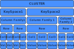

# Lenguaje CQL (*Cassnadra Query Language*)

Este lenguaje tiene muchas similitudes con SQL, pero también algunas diferencias. En esta sección vamos a ver las principales diferencias entre ambos lenguajes.

Cassandra **no permite realizar operaciones de *join*** entre tablas. Esto es debido a que las tablas en Cassandra están diseñadas para ser consultadas de forma independiente. Por lo tanto, si necesitamos realizar una consulta que implique datos de varias tablas, tendremos que realizar varias consultas y combinar los resultados en nuestra aplicación.

Si queremos hacer una agrupación de datos sólo podremos hacerlo con respecto a las columnas de la clave primaria. Por ejemplo, si tenemos una tabla con las columnas `id`, `name`, `age` y `city` y queremos agrupar por `city` y `age` tendremos que crear una tabla con una clave primaria compuesta por `city` y `age`. No podremos agrupar por `city` y `name` porque `name` no forma parte de la clave primaria.

Los elementos de una base de datos SQL tienen una correspondencia directa con los elementos de una base de datos Cassandra:

| SQL | Cassandra |
| --- | --------- |
| Base de datos | Keyspace |
| Tabla | *Column family* - CF |
| *Primary key* | *Primary key* / *Row key* |
| *Column name* | *Column name* / *key* |
| *Column value* | *Column value* |



## Tipos de datos en Cassandra

| Categoría | Tipo de dato CQL | Descripción |
| --------- | ---------------- | ----------- |
| String | `ascii` | Cadena de caracteres ASCII |
| " | `text` | Cadena de caracteres UTF-8 |
| " | `varchar` | Cadena de caracteres UTF-8 |
| " | `inet` | Dirección IP |
| Numeric | `int` | Número entero de 32 bits |
| " | `bigint` | Número entero de 64 bits |
| " | `float` | Número de coma flotante de 32 bits |
| " | `double` | Número de coma flotante de 64 bits |
| " | `decimal` | Número decimal de precisión variable |
| " | `varint` | Número entero de precisión variable |
| " | `counter` | Contador de 64 bits ( no se admite como clave) |
| UUID | `uuid` | Identificador único universal |
| " | `timeuuid` | Identificador único universal con información de tiempo |
| Collections | `list` | Lista de elementos ordenada |
| " | `set` | Conjunto de elementos no ordenado |
| " | `map` | Mapa de pares clave-valor |
| Misc | `boolean` | Valor booleano |
| " | `blob` | Secuencia de bytes |
| " | `timestamp` | Marca de tiempo |

## Comentarios en CQL

Cassandra admite tres tipos de comentarios:

* Comentarios de una línea: `--`<
* Comentarios de una línea: `//`
* Comentarios de varias líneas: `/* */`

## Creación del modelo de datos

### Creación de un *keyspace*

Para crear un *keyspace* utilizamos la sentencia `CREATE KEYSPACE`:

```cql
CREATE KEYSPACE <keyspace_name>
  WITH REPLICATION = { 'class' : 'SimpleStrategy', 'replication_factor' : <n> };
```

Existe también la sentencia opcional `AND DURABLE_WRITES = <verdadero o falso>` que indica que si los datos se han de escribir o no en el disco. Esta opción está activada por defecto.

Por ejemplo, para crear un *keyspace* llamado `my_keyspace` con una estrategia de replicación `SimpleStrategy` y un factor de replicación de 1 en el *datacenter 1* y 3 en el *datacenter 2* utilizaríamos la siguiente sentencia:

```cql
CREATE KEYSPACE my_keyspace
  WITH REPLICATION = { 'class' : 'NetworkTopologyStrategy', 'dc1' : 1, 'dc2' : 3 };
```

Para indicar que vamos a utilizar el *keyspace* `my_keyspace` utilizamos la sentencia `USE`:

```cql
USE my_keyspace;
```

### Modificar un *keyspace*

Para modificar un *keyspace* utilizamos la sentencia `ALTER KEYSPACE`:

```cql
ALTER KEYSPACE <keyspace_name>
  WITH REPLICATION = { 'class' : 'SimpleStrategy', 'replication_factor' : <n> };
```

### Borrar un *keyspace*

Para borrar un *keyspace* utilizamos la sentencia `DROP KEYSPACE`:

```cql
DROP KEYSPACE <keyspace_name>;
```

### Creación de una tabla

Para crear una tabla utilizamos la sentencia `CREATE TABLE`:

```cql
CREATE TABLE <table_name> [     IF NOT EXISTS ] (
  <column_name> <type> PRIMARY KEY,
  <column_name> <type>,
  ...
);
```

Veamos en detalle con un ejemplo:

```cql
CREATE TABLE monkey_species (
    species text PRIMARY KEY,
    common_name text,
    population varint,
    average_weight float,
    average_height float
) WITH comment = 'Tabla que almacena información sobre especies de monos';
```

En este ejemplo hemos creado una tabla llamada `monkey_species` con las siguientes columnas:

* `species`: clave primaria de tipo `text`.
* `common_name`: columna de tipo `text`.
* `population`: columna de tipo `varint`.
* `average_weight`: columna de tipo `float`.
* `average_height`: columna de tipo `float`.

También hemos añadido un comentario a la tabla.

Otro ejemplo algo más complejo:

```cql
CREATE TABLE timeline (
    user_id uuid,
    posted_month int,
    posted_time timeuuid,
    body text,
    posted_by text,
    PRIMARY KEY (user_id, posted_month, posted_time)
) WITH COMPACTION = { 'class' : 'LeveledCompactionStrategy' };
```

En este ejemplo hemos creado una tabla llamada `timeline` en la que definimos la clave primaria como una clave primaria compuesta por tres columnas:

* `user_id`: columna de tipo `uuid`.
* `posted_month`: columna de tipo `int`.
* `posted_time`: columna de tipo `timeuuid`.

No hemos especificado cual es la partition key y cual es la clustering key. Si queremos que `user_id` sea la partition key y `posted_month` y `posted_time` sean las clustering keys deberíamos haber definido la clave primaria de la siguiente forma:

```cql
PRIMARY KEY ((user_id) posted_month, posted_time)
```

al encerrar una o más columnas entre paréntesis indicamos que son la partition key. En este caso `user_id` es la partition key y `posted_month` y `posted_time` son las clustering keys.

Si tenemos una clustering key compuesta por varias columnas podemos indicar también la ordenación de las mismas. Por ejemplo, si queremos que `posted_month` sea descendente y `posted_time` ascendente deberíamos haber definido la clave primaria de la siguiente forma:

```cql
PRIMARY KEY ((user_id) posted_month, posted_time ) WITH CLUSTERING ORDER BY (posted_month DESC, posted_time ASC)
```

Si hay alguna columnas cuyos valores no van a cambiar podemos indicarlo con el modificador `static`. Por ejemplo, si queremos que `posted_by` sea una columna estática deberíamos haber definido la tabla de la siguiente forma:

```cql
CREATE TABLE timeline (
    user_id uuid,
    posted_month int,
    posted_time timeuuid,
    body text,
    posted_by text STATIC,
    PRIMARY KEY (user_id, posted_month, posted_time)
) WITH COMPACTION = { 'class' : 'LeveledCompactionStrategy' };
```

**Nótese que:** Una **primary key ha de ser única** pero ni la PK (partition key) ni la CK (clustering key) han de ser únicas por separado.

#### Modificar una tabla

Para modificar una tabla utilizamos la sentencia `ALTER TABLE`:

```cql
ALTER TABLE <table_name>
  ADD <column_name> <type>,
  DROP <column_name>,
  ALTER <column_name> TYPE <type>,
  RENAME <column_name> TO <new_column_name>,
  WITH <option> = <value>,
  ...
```

Un ejemplo sería:

```cql
ALTER TABLE monkey_species
  ADD average_lifespan int,
  DROP average_height,
  ALTER average_weight TYPE float,
  RENAME common_name TO name,
  WITH comment = 'Tabla que almacena información sobre especies de monos';
```

Si quisiésemos eliminar todos los registros de una tabla podemos utilizar la sentencia `TRUNCATE`:

```cql
TRUNCATE [ TABLE ] <table_name>;
```

Para eliminar una tabla utilizamos la sentencia `DROP TABLE`:

```cql
DROP TABLE [ IF EXISTS ] <table_name>;
```
