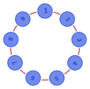

# Arquitectura de Cassandra

A diferencia de un *cluster* maestro-esclavo, en el que el nodo maestro es el responsable de encargarles a los nodos esclavos la ejecución de las consultas, en Cassandra todos los nodos son iguales y no hay un nodo maestro. En un cluster maestro-esclavo el nodo maestro supone un punto único de fallo, mientras que en Cassandra, al no existir nodos maestros, no hay un punto único de fallo. Cuando realizamos una operación en Cassandra habrá un nodo encargado de gestionarla pero ese nodo va cambiando con cada operación.

Un *cluster* de Cassandra se denomina *ring* o anillo. Este anillo está formado por varios nodos interconectados y configurados para propósitos de replicación. Los nodos serán *conscientes* de los otros nodos del anillo y de su estado y se comunicarán entre ellos para replicar los datos cumpliendo las condiciones de consistencia que se hayan establecido.

Cada nodo del anillo tiene la misma importancia que los demás, **no hay un nodo maestro** ya que se trata de un sistema P2P. Del mismo modo, en cada nodo habrá una instancia de Cassandra. Los nodos deberán de encontrarse, idealmente, en ubicaciones diferentes para evitar que un desastre natural pueda afectar a todos los nodos simultáneamente.

Todas estas característica hacen que no exista un **SPOF** (*Single Point Of Failure*), es decir, que no haya un punto único de fallo.

Un anillo de Cassandra también se denomina ***datacenter***.

## Nodos virtuales

Cada nodo del anillo se puede dividir a su vez en *nodos virtuales* (vnodes) concepto similar al de varias máquinas virtuales en una única máquina física. Cada nodo virtual se encarga de una parte del anillo del nodo *real*. De esta forma, si añadimos un nuevo nodo al anillo, este se dividirá en nodos virtuales y cada nodo virtual se encargará de una parte del anillo. Es decir, de una parte de los datos que le corresponde gestionar al nuevo nodo del anillo. Esto permite que el anillo se reequilibre de forma automática. Un nodo *real* puede distribuir sus datos entre varios nodos virtuales. Esto permite mejorar la disponibilidad de los datos al aumentar la replicación. Esto es similar a lo que sucede cuando establecemos varios servicios de una máquina de modo que se ejecuten en diferentes máquinas virtuales o contenedores.

## Jerarquía de Cassandra

En primer lugar tendremos el cluster, que estará formado por uno o varios *anillos* o *datacenters*. Cada *datacenter* estará formado a su vez por uno o más *racks*, que serán la agrupación lógica de varios servidores o nodos. Finalmente, los nodos estarán constituidos por uno o varios nodos virtuales.
