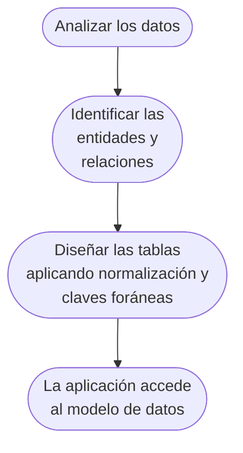
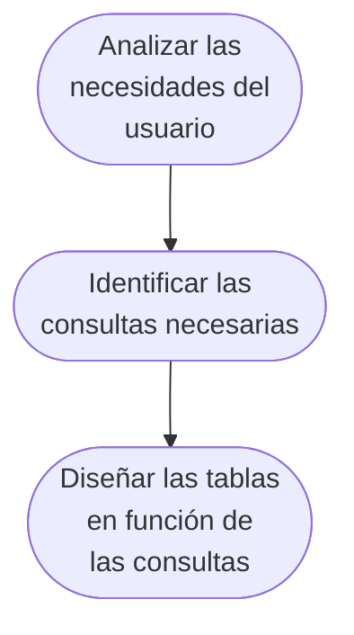
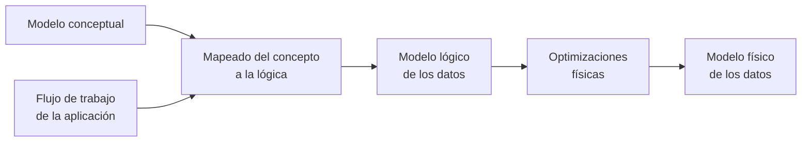

# Conceptos generales en modelado de datos

## Normalización de datos

La normalización es el proceso de diseñar las tablas y relaciones entre ellas de acuerdo a unas reglas diseñadas con el objetivo de **eliminar la redundancia y la inconsistencia**. Estas técnicas se aplican en los modelos relacionales y surgen de la necesidad de **optimizar el almacenamiento de datos en disco**. En la época en que surgieron estas técnicas, el almacenamiento en disco era muy caro y por tanto se buscaba optimizarlo. En la actualidad la situación ha cambiado y el almacenamiento en disco es muy barato, por lo que la normalización no es tan necesaria como antes. Esta es una de las razones por las que las bases de datos NoSQL como Cassandra no utiliza el modelo relacional.

### Ventajas de la normalización

* **Menor espacio de almacenamiento**: Al eliminar la redundancia se reduce el espacio de almacenamiento.
* **Menor tiempo de escritura**: Al eliminar la redundancia se reduce el tiempo de escritura.
* **Mayor integridad de los datos**: Al eliminar la redundancia se evita la posibilidad de que los datos se corrompan (dos copias del mismo dato con distintos valores).

### Desventajas de la normalización

* **Mayor tiempo de lectura**: Al eliminar la redundancia se aumenta el tiempo de lectura, ya que hay que realizar **más consultas** para obtener los datos.
* **Mayor complejidad en las consultas**: Al eliminar la redundancia se aumenta la **complejidad de las consultas** (sentencias [*join*](https://es.wikipedia.org/wiki/Sentencia_JOIN_en_SQL)).

## Desnormalización de datos

La desnormalización es el proceso de añadir redundancia a los datos con el objetivo de **mejorar el rendimiento**. En Cassandra se desnormalizan los datos para evitar las consultas [*join*](https://es.wikipedia.org/wiki/Sentencia_JOIN_en_SQL), que serían muy costosas en Cassandra (Cassandra no admite sentencias *join*). Hay que tener en cuenta que el precio del espacio de almacenamiento en disco es muy barato en la actualidad y las velocidades de escritura y lectura son muy altas, por lo que la desnormalización no es un problema en este aspecto.

### Ventajas de la desnormalización

Son a la inversa que las desventajas de la normalización:

* **Menor tiempo de lectura**: Al añadir redundancia se reduce el tiempo de lectura, ya que hay que realizar **menos consultas** para obtener los datos.
* **Menor complejidad en las consultas**: Al añadir redundancia se reduce la **complejidad de las consultas** (se pueden evitar las sentencias [*join*](https://es.wikipedia.org/wiki/Sentencia_JOIN_en_SQL), y los *join* anidados).

### Desventajas de la desnormalización

* **Múltiples escrituras**: Al añadir redundancia se aumenta el tiempo de escritura, ya que hay que escribir los datos en varios sitios.
* **Integridad manual de los datos**: Al añadir redundancia se aumenta la posibilidad de que los datos se corrompan (dos copias del mismo dato con distintos valores).

## Modelado relacional vs Cassandra

Cassandra es una base de datos diseñada con el objetivo de optimizar el rendimiento de las lecturas a escala. Para ello se sacrifica el rendimiento de las escrituras y la integridad de los datos. Por tanto, el modelado de datos en Cassandra es muy diferente al modelado de datos en bases de datos relacionales.

En Cassandra se emplea la desnormalización de datos en el proceso de modelado.

En un sistema de bases de datos relacional el modelado de datos sigue los siguientes pasos:

El proceso se inicia con los datos *crudos*. Se analizan sus características y se identifican las entidades y relaciones entre ellas. A continuación se diseñan las tablas aplicando la normalización para minimizar la redundancia y finalmente la aplicación accede al modelo de datos diseñando las consultas y demás operaciones **condicionada por el diseño previo**.

En cambio en Cassandra (y otras bases de datos NoSQL) el proceso es el siguiente:

Partimos de analizar cómo necesitamos consumir los datos, qué operaciones necesitará realizar la aplicación sobre ellos. En función de estas necesidades se diseñan las tablas y finalmente se organizan los datos en función del diseño previo.

Se parte de la aplicación y se *sube* hasta los datos, en vez de partir de los datos y *bajar* hasta la aplicación.

## Flujo de trabajo en el modelado de datos en Cassandra

El flujo de trabajo en el modelado de datos en Cassandra es el siguiente:

En primer lugar se analizará el flujo de trabajo de la aplicación (¿Qué hacen los usuarios en la aplicación?) y se determinan también cual es el modelo conceptual de los datos: qué entidades podemos encontrar y relaciones que existen entre las mismas.
Con esta información empezaremos a enlazar la lógica de la aplicación al modelo de datos. Seguirán las optimizaciones físicas que se puedan detectar y finalmente el modelo físico de los datos, que es cómo se van a almacenar los datos en disco.
