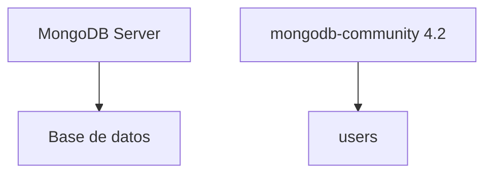
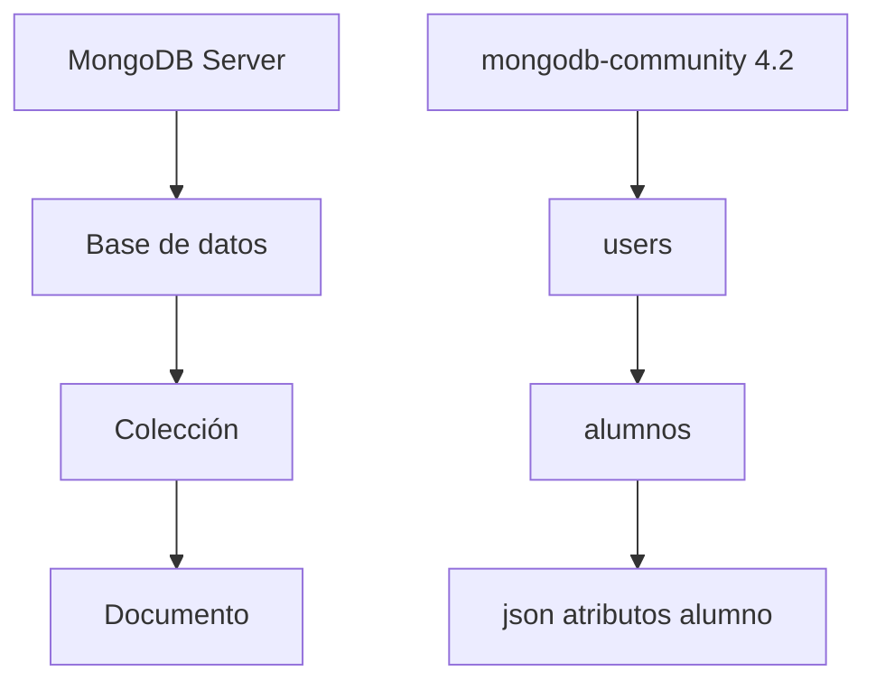

# Antes de nada

## Instalación local de MongoDB

Para instalar MongoDB en Ubuntu podréis seguir la información que se incluye en la [página de documentación](https://www.mongodb.com/docs/manual/administration/install-community/#std-label-install-mdb-community-edition) de MongoDB. Concretamente en [este link](https://www.mongodb.com/docs/manual/tutorial/install-mongodb-on-ubuntu/#std-label-install-mdb-community-ubuntu).

## Añadir datos de prueba

La forma más fácil de añadir datos a MongoDB es usando el comando `mongoimport`. Para ello necesitaremos un fichero con los datos en formato CSV, TSV y JSON.
En los siguientes enlaces podéis encontrar datos de prueba a uar con MongoDB:

* [MongDB JSON Data](https://github.com/ozlerhakan/mongodb-json-files).
* [Inside Airbnb](http://insideairbnb.com/get-the-data.html).
* [Kaggle](https://www.kaggle.com/datasets).

La forma más sencilla de importar un CSV es usando el comando `mongoimport`:

```bash
mongoimport -d <nombre de la base de datos> -c <nombre de la colección> --type csv --headerline --file <ruta del fichero con los datos>
```

La opción `—-headerline` sólo se puede aplicar cuando el tipo de datos es `csv` o `tsv` y le indica a mongo que asuma que la primera línea del archivo de texto contiene los nombres de los campos. Si no fuese el caso tendríamos que usar la opción:

`-f=<field>[,<field>]*`

indicando los nombres de los campos separados por comas.

Si los datos están en formato JSON no es necesario indicar el tipo de fichero.

## Bases de datos tradicionales / SQL / relacionales

Se organizan en entidades llamadas tablas.

Cada tabla está formada por filas (rows) o registros.

Pueden existir relaciones entre tablas (relacionales). Estas relaciones se *articulan* con respecto a uno o más atributos de las tablas relacionadas.

Usan SQL como lenguaje de consulta.

Permiten el uso de transacciones lo que garantiza que se cumplan los principios ACID:

*(Tomado directamente de la entrada en la Wikipedia)*

* **[Atomicidad](https://es.wikipedia.org/wiki/Atomicidad):** Si cuando una operación consiste en una serie de pasos, de los que o bien se ejecutan todos o ninguno, es decir, las transacciones son completas.
* **[Consistencia](https://es.wikipedia.org/wiki/Consistencia_de_datos):** (*Integridad*). Es la propiedad que asegura que sólo se empieza aquello que se puede acabar. Por lo tanto se ejecutan aquellas operaciones que no van a romper las reglas y directrices de *Integridad* de la base de datos. La propiedad de consistencia sostiene que cualquier transacción llevará a la base de datos desde un estado válido a otro también válido. "La Integridad de la Base de Datos nos permite asegurar que los datos son exactos y consistentes, es decir que estén siempre intactos, sean siempre los esperados y que de ninguna manera cambian ni se deformen. De esta manera podemos garantizar que la información que se presenta al usuario será siempre la misma."
* **[Aislamiento](https://es.wikipedia.org/wiki/Aislamiento_(ACID)):** Esta propiedad asegura que una operación no puede afectar a otras. Esto asegura que la realización de dos transacciones sobre la misma información sean independientes y no generen ningún tipo de error. Esta propiedad define cómo y cuándo los cambios producidos por una operación se hacen visibles para las demás operaciones concurrentes. El aislamiento puede alcanzarse en distintos niveles, siendo el parámetro esencial a la hora de seleccionar [SGBDs](https://es.wikipedia.org/wiki/Sistema_de_gestión_de_bases_de_datos).
* **[Durabilidad](https://es.wikipedia.org/wiki/Datos_persistentes):** (*Persistencia*). Esta propiedad asegura que una vez realizada la operación, esta persistirá y no se podrá deshacer aunque falle el sistema y que de esta forma los datos sobrevivan de alguna manera.

Para dividir la información entre tablas se emplean procesos de normalización (cuyo objetivo es evitar redundancia de datos y facilitar la realización de consultas).

Siguen un **esquema** (todos los registros / rows de cada tabla tienen el mismo número de campos con el mismo tipo de datos). Cada tabla (y en consecuencia la BD) sigue una estructura predefinida.

## Bases de datos NoSQL

Surgen como respuesta a problemas que las BD tradicionales no podían resolver:

* La información que se quiere guardar no está estructurada.
* Muy poco flexibles (debido a que se ha de cumplir el **esquema**).

Son las ideales para almacenar datos que no tienen una estructura fija.

**No garantizan** los principios **ACID**.

**MongoDB sí soporta transacciones (atomicidad).**

NoSQL = No sólo SQL.

Puesto que las bases de datos NOSQL suelen ser distribuidas se les aplicará el **teorema CAP**.

### Teorema CAP

*(De nuevo directamente de la Wikipedia)*

En Ciencias de la computación, el teorema CAP, también llamado Conjetura de Brewer, enuncia que es imposible para un sistema de cómputo distribuido garantizar simultáneamente:

1. La **consistencia (Consistency)**, es decir, cualquier lectura recibe como respuesta la escritura más reciente o un error.

2. La **disponibilidad (Availability)**, es decir, cualquier petición recibe una respuesta no errónea, pero sin la garantía de que contenga la escritura más reciente.

3. La **tolerancia al particionado (Partition Tolerance)**, es decir, el sistema sigue funcionando incluso si un número arbitrario de mensajes son descartados (o retrasados) entre nodos de la red.

Según el teorema, **un sistema no puede asegurar más de dos de estas tres características simultáneamente**.

Existen varios tipos:

* Documentales: (MongoDB).
* Columnares: (Cassandra).
* Clave-valor: funcionan como índices (Redis, Amazon DynamoDB).
* Orientadas a grafos: ¿estadística y Big Data? (Amazon Neptune).

## Características de MongoDB

* Orientada a documentos ( = archivos JSON).
* Sin esquema *schemaless*.
* Usa JSON.

En mongo los documentos JSON se utilizan en todas las operaciones. Para seleccionar los documentos que obtendremos en una búsqueda se utilizará un *query document* indicando el criterio de selección. Para modificar uno o más documentos usaremos un query document y otro documento en el que se darán instrucciones sobre que modificaciones se realizarán. Finalmente, la forma de pasar opciones a los comandos es también mediante un documento.

### Formato JSON

Javascript Simple Object Notation

```json
{
    "numero": 10,
    valores: [1, 2, 3],
    masValores: {
        uno: [{uno: 1}, {dos: true}, {tres: 3}],
        dos: false
    }
}
```

### Uso desde la *shell*

En Linux lanzaremos la *shell* de mongo mediante el comando `mongosh`. Esta shell consiste en un REPL (*Read Eval Print Loop*) de Node.js por lo que podremos escribir código JavaScript además de cagar scripts (usando la instrucción `load`) o bien desde la consola de Linux con la opción `--file` de `mongosh`.

#### Conexión a un servidor de MongoDB

Si tenemos instalado MongoDB en local y no hemos cambiado la configuración por defecto bastará con ejecutar el comando `mongosh` para conectarnos a la instancia de MongoDB que se esté ejecutando en el equipo local. Si queremos conectarnos a un servidor remoto usaremos el comando `mongosh <dirección del servidor>`.

Para que el servidor de MongoDB acepte conexiones remotas debemos modificar el fichero de configuración `/etc/mongod.conf`. En concreto la opción `bindIp` que por defecto está comentada y tiene el valor `127.0.0.1` (localhost). Para que acepte conexiones remotas debemos indicar la IP del equipo en **el que se está ejecutando el servidor de MongoDB**.

```yaml
# network interfaces
net:
  port: 27017
  ip: 127.0.0.1,192.168.101.20 # en nuestro ejemplo.
```

Una vez hecho esto debemos reiniciar el servicio de MongoDB con el comando `sudo systemctl restart mongod`.

Para conectarnos al servidor remoto usaremos el comando:

```bash
mongosh "mongodb://192.168.101.20:27017"
```

o bien:

```bash
mongosh 192.168.101.20
```

Ya que tanto el puerto como el protocolo, si no los hemos cambiados, se pueden inferir.

Si aún así no tenemos conexión podría se un problema de las reglas del cortafuegos. En ese caso deberemos abrir el puerto 27017 en el cortafuegos del servidor de MongoDB:

```bash
sudo ufw allow from <ip del equipo cliente> to any port 27017
```

#### Comandos básicos

* Salir de la consola: `.exit` (también se puede usar `quit`)
* *Limpiar* la consola: `Ctrl + L`.
* Mostrar información de ayuda sobre los comandos: `db.help()`.
* Mostrar las bases de datos / colecciones del servidor: `show dbs` / `show collections`.
* Seleccionar una base de datos: `use <nombre de la DB>`.
* Colecciones o *tablas* que puedes tener una una DB: `show collections` o `show tables`.
* Consultar el nombre de la base de datos activa: `db.getName()`.
* Consultar los metadatos de la base de datos activa: `db.stats()`.
* Obtener información sobre el sistema dónde se está ejecutando Mongodb: `db.hostInfo()`.
* *Mostrar el contenido de una colección*: `db.<colección>.find().pretty()`.

#### Ejecución de scripts desde la *shell*

Desde la shell de mongo, recordemos que incorpora el intérprete de JavaScript Node.js, podemos ejecutar código JavaScript.

Para ejecutar un script desde la *shell* de mongo podremos usar el comando `load`:

```bash
load("<ruta del fichero JavaScript>")
```

Otra forma de ejecutar un script sin salir de la consola de Linux es usando la opción `--file` de `mongosh`:

```bash
mongosh --file <ruta del fichero JavaScript>
```

### Creación y gestión de bases de datos



Para crear una base de datos simplemente hay que indicar que se quiere *usar* una base de datos con ese nombre.

Si queremos crear una base de datos con el nombre `clientes` escribiremos el comando: `use clientes` (en realidad no la mostrará hasta que se inserte algún elemento).

Para insertar un elemento (**documento**) podemos usar el comando:

```text
db.clientes.insertOne({'id': '1', 'nombre': 'Manuel', 'Apellidos': 'Piñeiro Mourazos'})
```

También crearíamos la base de datos `cliente` si utilizamos únicamente la instrucción previa.

**Para eliminar una base de datos** primero la tenemos que hacer activa con `use <nombre DB>` y después invocaremos el comando `db.dropDatabase()`.

## Colecciones y documentos



### Colección

El equivalente en MongoDB a las **tablas** de las bases de datos tradicional.

### Documento

El equivalente a las ***filas* o *registros*** de una base de datos tradicional.

### Propiedades

Lo que un *registro* de las bases de datos tradicionales se denominaría ***columnas*** o campos.

## Tipos de datos

Los tipos de datos descritos en MongoDB se dividen en dos tipos básicos: **simples** y **complejos**.

### Tipos de datos simples

* números
* cadenas de texto
* fecha y hora: se muestra con formato ISO 8601.
* booleanos

#### Ampliación sobre fechas

Para insertar la fecha y hora de hoy en un documento podremos usar el comando `Date()`.

```json
{
    actualizado: Date()
}
```

Para indicar una fecha concreta hemos de usar el comando `new Date(<fecha>)`.

```json
{
    fecha_nacimiento: new Date('1900-01-01')
}
```

La función / constructor de `Date` acepta los siguientes formatos:

* `<YYYY-mm-dd>` especifica la fecha en el formato ISODate y devuelve el ISODate con la hora establecida a medianoche en UTC.
* `new Date("<YYYY-mm-ddTHH:MM:ss>")` especifica la fecha en la hora local del cliente y devuelve el ISODate con la hora establecida en UTC.
* `new Date("<YYYY-mm-ddTHH:MM:ssZ>")` especifica la fecha en UTC y devuelve el ISODate con la hora establecida en UTC.
* `new Date(<integer>)` especifica la fecha como el **tiempo Unix** o **tiempo POSIX**, el número de milisegundos transcurridos desde la medianoche UTC del 1 de enero de 1970.

Establecerá `fecha_nacimiento` al objeto Date de valor equivalente a `1900-01-01T00:00:00:000z`.

También aceptan formatos más *informales*. Por ejemplo: `new Date("15, may, 1977")` o `new Date("01/01/1900 00:00:00")`.

### Tipos de datos complejos

* *arrays*
* objeto
* *binary data*
* *objectId*
* Expresiones regulares
