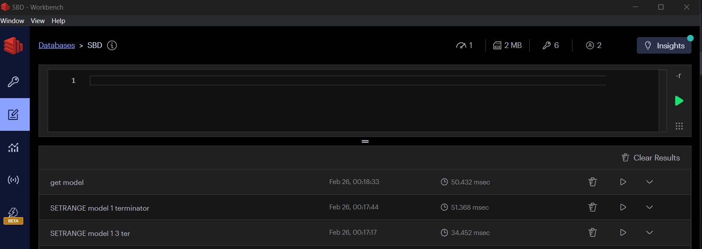

# Redis

Las características fundamentales de la base de datos Redis son las siguientes:

* Es una base de datos que se mantiene en memoria, lo que implica gran velocidad.
* Almacena los datos en la forma de pares clave &rarr; valor.
* Se utiliza tradicionalmente como una capa de caché.
* Redis es una base de datos síncrona y mono-hilo, las peticiones se procesan de manera secuencial.

Al tratarse de un sistema en memoria es lógico que se use como caché (de una base de datos en disco o un servidor web por ejemplo) y no como una base de datos primaria. Actualmente se puede usar como una base de datos única y no sólo como una caché apoyándose principalmente en un conjunto de *plugins* o módulos. Este conjunto de módulos es lo que se conoce como Redis stack y permiten usar Redis como una base de datos documental, orientada a grafos, etc. Redis sin módulos se denomina Redis core. ## Persistencia de los datos

Acabamos de indicar que Redis es una base de datos en memoria y a continuación dijimos que, a día de hoy, se puede emplear como una base de datos primaria. ¿Cómo se persisten entonces los datos?

Por defecto Redis consta de dos métodos para guardar la información:

1. Redis vuelca a disco el contenido de la base de datos cada cierto tiempo (por defecto cada 15 min.).
2. Redis puede registrar cada comando realizado sobre la base de datos en un fichero de *log* guardado en disco.

## Módulos de Redis

Los módulos extienden la funcionalidad de los servidores Redis de distintas formas. Los módulos
no tienen por que ser desarrollados por Redis Labs, sino que pueden ser desarrollados por terceros.

Ejemplos de módulos de redis:

* [RediSearch](https://github.com/RediSearch/RediSearch): Permite realizar consultas, indexado secundario y búsqueda de texto completo.
* [RedisJSON](https://github.com/RedisJSON/RedisJSON): Hace que redis funcione como una base de datos similar a MongoDB. Permitiendo almacenar y recuperar documentos JSON.
* [RedisGraph / FalkorDB](https://github.com/FalkorDB/FalkorDB/): Que hace posible utilizar Redis como una base de datos orientada a grafos.

Estos son sólo algunos ejemplos. Hay otros módulos que dan soporte para estructuras de datos [probabilísticas](https://redis.io/docs/data-types/probabilistic/bloom-filter/), datos de [series temporales](https://redis.io/docs/data-types/timeseries/), etc.

### RediSearch

Es un proyecto *open source* concebido originalmente como una herramienta para realizar *full text search* en Redis. Con el tiempo ha ido aumentado en capacidades y volviéndose más de propósito general al punto de que permite realizar indexado de campos, consultas similares a las SQL (exceptuando operaciones de *join*) y operaciones de agregación.

En resumen es un módulo muy recomendable si vamos a trabajar con datos estructurados en Redis.

### RedisJSON

Al igual que RedisJSON es un módulo que nos permite almacenar y manipular datos en formato JSON en Redis.

Podremos, por ejemplo, realizar operaciones de *get* y *set* sobre campos concretos del un documento JSON, crear documentos anidados, etc.

En Redis tradicional se pueden almacenar JSON en forma de cadenas (se serializaría el JSON al guardarlo y se de-serializaría al leerlo) o con hashes (se guardarían los campos del JSON como campos de la clave). Estos dos métodos presentan serias limitaciones como las operaciones extra en el caso de las cadenas o la imposibilidad de anidar documentos si utilizamos hashes.

### FalkorD (antes RedisGraph)

FalkorD (es un *fork* de un proyecto ahora abandonado llamado RedisGraph) es un módulo que nos permite trabajar con Redis como si se tratase de una **base de datos orientada a grafos**.

#### Base de datos orientada a grafos

Una base de datos orientada a grafos dispone de una API de consulta que permite trabajar con grafos de propiedades. En una base de datos orientada a grafos *nativa* el acceso a los elementos adyacentes a un nodo ha de ser muy rápido ($O(1)$).

#### Grafos de propiedades

Un grafo es un conjunto de vértices (nodos) y aristas (relaciones entre nodos). En este tipo de base de datos esta estructura consta de 4 elementos:

* Nodos (vértices).
* Relaciones (aristas).
* Etiquetas / tipos de relaciones: La etiquetas están asociadas a los nodos y los tipos de relación a las relaciones.
* Propiedades: Tanto los nodos como las relaciones pueden tener propiedades. Consisten en un mapa
clave &rarr; valor o diccionario.

FalkorDB soporta [Cypher](https://neo4j.com/developer/cypher/) como lenguaje de consulta. Cypher es un lenguaje de consulta de grafos similar a SQL y es el utilizado en la base de datos orientada a grafos [Neo4j](https://neo4j.com/).

Estos que acabamos de ver no son los únicos módulos que existen para Redis pero son suficientes para
ilustrar la forma en la que aumentan las capacidades de Redis.

Aunque Redis pueda ser ampliada con los módulos que acabamos de mencionar, lo que hacen es utilizar el Redis *básico* para construir sobre él distintos tipos de bases de datos más elaboradas. Por debajo no dejamos de tener una base de datos en memoria, muy rápida y con gran enfoque en las cadenas.

A continuación veremos las características básicas de Redis.

## Tipos de datos en Redis

Una de las características de Redis es que dispone de un **conjunto de operaciones específico para cada tipo de datos**. De este modo, tendremos un conjunto de *funciones* par realizar las operaciones CRUD sobre *strings*, otro conjunto para listas, otro para conjuntos y así sucesivamente. Podemos verlo en la [página de referencia](https://redis.io/commands/) de los comandos de Redis donde podemos comprobar que permite filtrar comandos por tipo de dato.

### Tipos de datos

Los tipos de datos que soporta Redis son los siguientes:

* *Strings*: El tipo de dato más básico de Redis. Constituyen secuencias de bytes y es el tipo utilizado para almacenar valores numéricos.
* Listas: So secuencias de cadenas ordenados en función del momento de inserción. Los valores no tienen que encontrarse en posiciones contiguas de memoria, el acceso será secuencial y será más rápido al principio y al final de la lista.
* *Sets*: Constituyen colecciones no ordenadas de cadenas. A diferencia de las listas no admiten cadenas repetidas.
* *Sorted sets*: Almacenan cadenas (no repetidas) ordenadas. Cada cadena tiene un valor asociado que se utiliza para ordenar los elementos. No admiten elementos repetidos.
* *Hashes*: Consisten en pares clave &rarr; valor. Cada registro tendrá uno o más pares que se almacenan internamente con una lista de cadenas.  Se almacenan en forma de pares "clave" / "valor" asociados a una única clave principal. **No admiten anidamiento**.
* *Streams*: Se trata de un estructura que se comporta como un registro al que sólo se pueden añadir datos. Sirven para registrar eventos en el orden en que han ocurrido. Se utilizan para almacenar datos en forma de *logs*.
* *Geospatial*: Permiten almacenar datos geográficos y realizar operaciones sobre ellos.
* *Bitmaps*: Permiten realizar operaciones a nivel de bits sobre cadenas.
* *Bitfields*: Codifican múltiples contadores en una única cadena. Permiten realizar operaciones **atómicas** de *get*, *set* y *increment*.
* *HyperLogLog*: Es una estructura de datos probabilística que permite estimar el número de elementos de conjuntos de gran tamaño.

Además de estos datos básicos existen los tipos de datos *complejos* que se pueden utilizar gracias
a los módulos que hemos visto como es el caso del tipo JSON.

## Entorno de pruebas (Redis Cloud)

Para probar el funcionamiento de Redis podemos utilizar la versión gratuita de Redis Cloud. Para ello hemos de seguir los siguientes pasos:

1. Ir a [Redis.com](www.redis.com).
2. Darse de alta.
3. Entrar y solicitar una subscripción (la gratuita es más que necesaria para cubrir las necesidades de nuestro curso).

Usaremos [RedisInsight](https://redis.io/docs/connect/insight/) para conectarnos a la base de datos.

Otras formas de probar Redis pueden ser utilizar Docker o instalarlo en nuestro propio equipo o
máquina virtual.

## Comandos básicos

Una vez conectados con Redis insight a nuestra base de datos de pruebas podremos usar la consola (accesible mediante la pestaña de *Workbench*) para ejecutar comandos sobre la base de datos.



Como dijimos, los comandos de redis se agrupan en función del tipo de datos con el que trabajan. Así, si vamos a la documentación y filtramos por *string* veremos que los comandos que nos muestra son: `APPEND`, `DECR`, `DECRBY`, `GET`, `GETDEL`, etc.

A continuación veremos como ejemplo los comandos básicos para trabajar con cadenas y números (ya que están representados internamente como cadenas). Para ver los comandos disponibles para cualquier otro tipo simplemente tendremos que ir a la página de comandos y filtra por dicho tipo de dato.


### Salvar datos

Si miramos la documentación de un comando, como por ejemplo `SET` veremos que lo primero que nos muestra esa la sintaxis
de la siguiente forma:

```text
SET key value [NX | XX] [GET] [EX seconds | PX milliseconds |
EXAT unix-time-seconds | PXAT unix-time-milliseconds | KEEPTTL]
```

Esto nos indica lo siguiente:

* El nombre del comando es `SET`.
* Es nombre irá seguido de la clave (*key*) y el valor a guardar (*value*).
* A continuación seguirá **una** de las siguientes posibles instrucciones:
  * Cuando guardar:
    * `NX`: Guardar el valor sólo si la clave no existe ya.
    * `XX`: Guardar el valor sólo si la clave ya existe.
  * Cuanto ha de durar el valor guardado:
    * `EX` segundos: Establece un tiempo de expiración en segundos.
    * `PX` milisegundos: Establece un tiempo de expiración en milisegundos.
    * `EXAT` unix-time-seconds: Establece un tiempo de expiración en segundos.
    * `PXAT` unix-time-milliseconds: Establece un tiempo de expiración en milisegundos.
    * `KEEPTTL`: Mantener el tiempo de expiración de la clave.
  * `GET`: Devuelve el valor anterior de la clave.

Para salvar datos en Redis utilizamos el comando `SET`:

```bash
SET <key> <value> <opciones>
```

#### Ejemplo

Si queremos guardar el valor `rojo` en la clave `color` con con un tiempo de expiración de 10 segundos usaremos la
siguiente expresión:

```bash
SET color rojo EX 10
```

Existe también el comando `SETEX` que nos permite hacer lo mismo en una sola instrucción pero se ha
declarado obsoleto y se recomienda usar `SET` con la opción `EX`.

#### Sobre los tiempos de expiración

Redis fue diseñada originalmente como una base de datos en memoria que funcionase como un servicio de caché. La idea es que guardase ciertos datos durante un tiempo y luego se deshiciese de ellos. Si, por ejemplo, vamos a usar Redis como
una cache para reducir el acceso a una base de datos tradicional (mucho más lenta que Redis), nos va a interesar ir
borrando los datos a los que no se ha accedido durante un cierto tiempo para evitar que la caché crezca sin control. Como veremos más adelante, el comando `GETEX` ofrece la opción de establecer el tiempo de expiración de la clave consultada.

### Salvar múltiples valores

Para salvar múltiples valores en Redis utilizamos el comando `MSET`:

```bash
MSET <key1> <value1> [<key2> <value2> ...]
```

### Recuperar datos

Para recuperar datos en Redis podemos utilizar los comandos `GET`, `GETDEL`, `GETSET`, `GETEX` y
`GETRANGE`:

* `GET`: La sintaxis de este comando es `GET <key>`. Devuelve el valor asociado a la clave.
* `GETDEL`: Con la misma sintaxis que `GET` devuelve el valor asociado a la clave y borra la clave.
* `GETSET`: La sintaxis es la de `GETSET <key> <value>`. Devuelve el valor anterior y establece un
valor nuevo de manera atómica. El ttl anterior se descarta. Se usa con `INCR` para disponer de un
*reset* atómico.
* `GETEX`: Devuelve el valor asociado a la clave y establece un tiempo de expiración. La sintaxis
para indicar el tiempo de expiración es similar a la de `SET`.
* `GETRANGE`: Con la sintaxis `GETRANGE <key> <start> <end>`. Permite obtener una sub-cadena de la
cadena asociada a la clave.

Veamos un ejemplo:

```bash
GET nombre0
```

### Recuperar múltiples valores

Para recuperar múltiples valores en Redis utilizamos el comando `MGET`:

```bash
MGET <key1> <key2> ...
```

### Modificar datos

Los comandos para modificar datos en Redis son `SET`, `SETRANGE`, `DECR`, `DECRBY`, `INCR`,
`INCRBY` e `INCRBYFLOAT`.

* `SETRANGE`: Con la sintaxis `SETRANGE <key> <offset> <value>`. Modifica una sub-cadena de la
cadena almacenada.
* `DECR` e `INCR`: Con la sintaxis `DECR <key>` y `INCR <key>`. Decrementa o incrementa en uno el
valor asociada a la clave e una unidad **de manera atómica**.
* `DECRBY` e `INCRBY`: Con la sintaxis `DECRBY <key> <decrement>` y `INCRBY <key> <increment>`.
Decrementa o incrementa el valor asociado a la clave en la cantidad indicada.
* `APPEND`: Si la llave existe, añade un una cadena al final del valor asociado a la clave. Si no existe, crea la clave y le asigna el valor (en este caso funciona como `set`).

### Borrar datos

Para borrar datos en Redis utilizamos el comando `DEL`:

```bash
DEL <key> [<key> ...]
```

### Rangos de cadenas

Tenemos dos comandos que nos permiten trabajar con porciones de cadenas: `GETRANGE` y `SETRANGE`.

`GETRANGE` nos permite recuperar un rango de caracteres de una cadena.

```bash
SET model toyota
"OK"
GETRANGE nombre 0 3 # Devuelve los caracteres entre la posición 0 y la 5.
"toyo"
```

`SETRANGE` nos permite modificar un rango de caracteres de una cadena.

```bash
SETRAGE mopel 1 terminator
(integer) 11
GET modelo
"tterminator"
```

## *Scripts* en Redis

Además de los comandos básicos que podemos invocar en la *shell*, Redis también permite la ejecución de scripts. Estos han de estar escritos en [Lua](https://lua.org/about.html). Lua es un lenguaje de programación sencillo utilizado en aplicaciones embebidas y en juegos que también se utiliza como sistema de configuración de aplicaciones (como el caso de neovim).

Para ejecutar un *script* en Redis usaremos el comando `EVAL`:

```bash
EVAL <script> <num_claves> <clave> [<clave> ... ] <arg> [<arg> ... ]
```

El script ha de indicarse entre `"`. A continuación se indicarán el número de pares *clave - valor* que se pasarán como argumentos al script y finalmente los valores de las claves seguidos de los valores que se corresponden con dichas claves.

En Redis estos *scripts* se ejecutan de **manera atómica**, de manera que la base de tatos queda *bloqueada* hasta que se completa la ejecución del script.

## ¿Cómo usar Redis?

Supongamos que tenemos una base de datos tradicional. En ella tendremos múltiples registros con varios campos. No es algo fuera de lo común que algunos campos tengan un número limitado de valores posibles. Los modelos de un coche, los colores, etc. son ejemplos de campos con valores limitados. Podremos guardar este tipo de valores en Redis codificándolos mediante una clave más corta. Por ejemplo, en lugar de guardar el modelo completo del coche guardaremos un número (o código) que represente el modelo.

Una vez tenemos los campos codificados podremos guardar el registro como una concatenación del las claves de los valores de sus registros usando la clave única del registro como clave en Redis.

Para recuperar los campos de un un registro en Redis usaremos `GETRANGE` para recuperar la clave del valor de dicho campo.

Para modificar el valor de uno o más campos haremos usar `SETRANGE`.

## Metodología de diseño de Redis

La metodología de Redis es común en las bases de datos NoSQL. Al contrario que en las bases de datos relacionales, no se parte de los datos, si no que primero se ha de determinar que consultas vamos a realizar en nuestra aplicación. Una vez determinadas las consultas se organizarán los datos de manera que las consultas sean lo más eficientes posible.

Preguntas que tendremos que responder:

* ¿Qué datos vamos a guardar?
* ¿Vamos a tener que preocuparnos por el tamaño de los datos?: Recordemos que Redis guarda todo en
memoria, por lo que tendremos un límite en el tamaño de los datos que podemos guardar.
* ¿Tienen que *caducar* los datos?
* ¿Cuál será nuestra política de generación de claves?
* ¿Habrá que tener en cuenta algún aspecto de la lógica interna de la aplicación?

### Nombrado de claves

La política de nombrado de claves establece los siguientes puntos:

* Las claves han de ser únicas.
* Las claves han de ser descriptivas. Si las ven otras personas han de ser capaces de entender a qué
se refieren.
* Es una buena práctica usar funciones para generar los nombres de las claves y así evitar posible
erratas.
* Es una práctica común separar las palabras que forman el nombre de la clave con `:` y `#` para
separar las palabras del identificador.

Esta última práctica se usarás para, por ejemplo, crear claves como `users#14` o `email#101` donde
el primer elemento de la clave es el tipo de dato y el segundo elemento es el identificador del
dato. No tiene que limitarse a una única palabra (`users:reviews#96`) y el identificador no tiene
porque ser un número (`posts#x14jff`).
En el contexto de Redis es común nombrar las claves con dos o más campos, separando la parte que
constituye el identificador de la parte que nos indica qué almacenamos. Estas partes se suelen
separar por `:`. De este modo, si queremos almacenar las *reviews* de los usuarios podríamos usar
una clave de la forma: `users:reviews:<id>`. Donde `<id>` podría ser un "número" o un valor numérico
que identifique unívocamente a una *review*.

